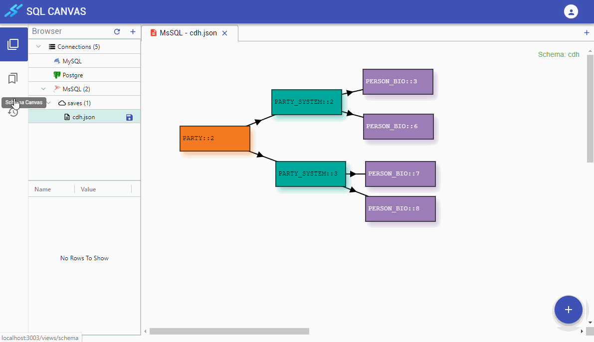

## View History

All executed _SQL Statements_ of the current section are stored and can be accessd in the **History** view:

1. Select **History** on the sidebar to open the **History** view.
2. Double-click on a line under a _Connection Name_ to view that history

> Note: When multiple object types were return (i.e. from SELECT Builder), multiple _tab_ will be shown for each object type in **Bottom** View

> Note: When multiple **INSERT/UPDATE** or **SELECT** were executed within the same transaction, multiple _tab_ will be shown for each object type in **Top** View. The Browser will denote each of these entries with **BATCH**

## Export SQL Result

Right-click on a row in **Bottom** View and select **Export** to export the SELECT results. 

> Note: More Export options like JSON and XML are under development

## Clear History

Click on the **Clear All** button in the **Browser** tab to clear.

> Note: Large number of statements and results in storage can affect performance. Consider clearing history when it's no longer needed.
