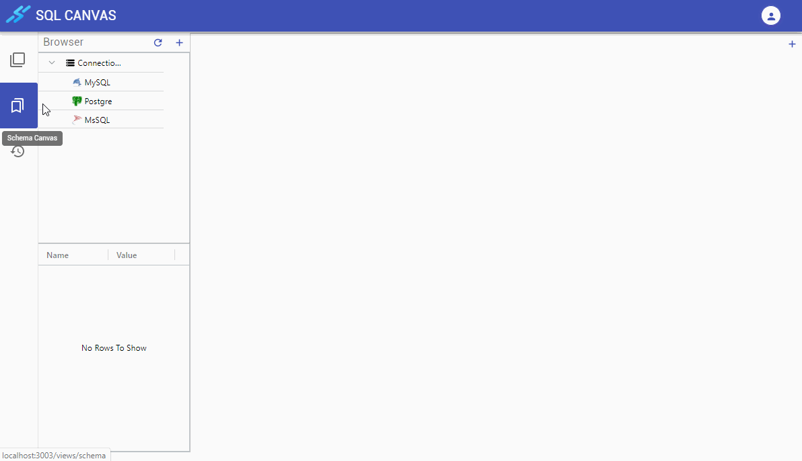

## View Schema

To view a _Schema_ and its objects, perform the following steps:

1. Select **Schema** on the sidebar to open the _Schema_ view.
2. Connect to a database. A List of schema will be list under the connection name/alias
3. Double-click on a schema to open it on Canvas

## Save Schema View

If you want to save the current view of schema objects, right-click the schema and click **Save**, or use short cut **Ctrl+S** when on Canvas, next time you open this schema is will return to this saved view.

> Note: Unlike Object Canvas, Schema Canvas only save the location and the customization of schema object (e.g. color, shape), the column name and type are not stored and retrieved in case there are changed to the saved schema